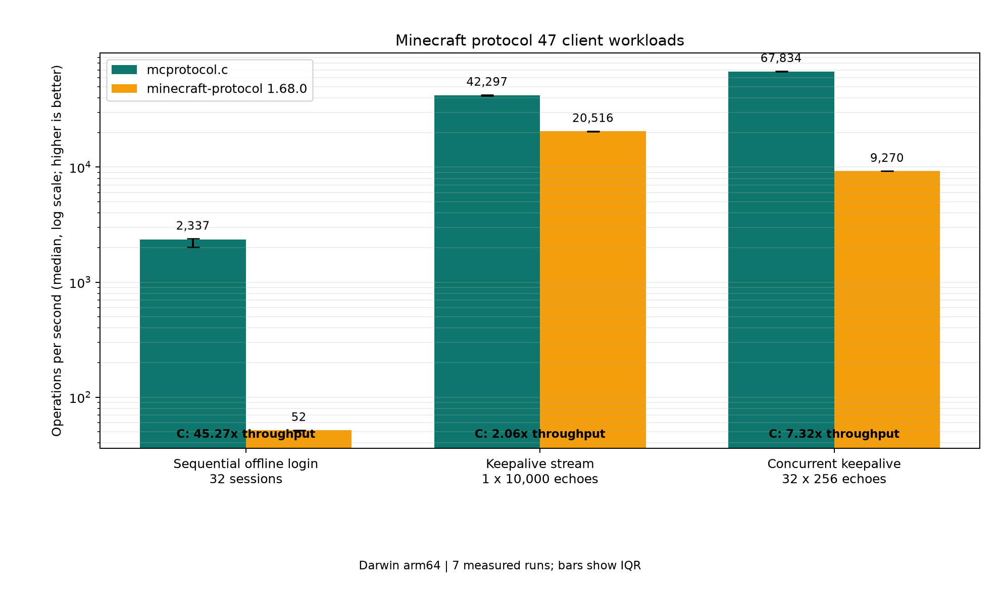

# mcprotocol.c

A compact C11 implementation of the Minecraft Java protocol for clients,
protocol tools and raw servers.

`mcprotocol.c` owns TCP, framing, compression, state, packet catalogs and the
wire codecs. The application decides which packets to send and what their
contents mean.

It is not Mineflayer: gameplay behaviours such as pathfinding, movement,
crafting and combat belong to the application.

## Features

- 51 protocol revisions from protocol 4 through 776 (Minecraft 1.7–26.2);
- offline client login, raw custom login, server-list status and raw server
  accept/handshake;
- complete versioned packet name/ID catalogs plus allocation-free C readers and
  writers for the important Minecraft wire types;
- stable structured errors, strict/Vanilla-compatible decoding and a pure
  exact-consumption dispatcher for typed packet families;
- bounded incremental stream framing, canonical cross-version views,
  deterministic replay and borrowed inventory/chunk iterators;
- zlib framing, ordered multi-packet batching and optional external stream
  transforms for online-mode encryption;
- native readiness backends: `io_uring` with `epoll` fallback on Linux,
  `kqueue` on macOS and `poll` elsewhere.

The library has no Node.js, SDL, UI or runtime data-file dependency. Production
code is contained in `api.c` and `api.h`.

## Build

Requirements are a C11 compiler, `make`, `ar` and zlib development headers.
On Debian or Ubuntu:

```sh
sudo apt-get install build-essential zlib1g-dev
```

Build the static library:

```sh
make
```

This creates `libmcprotocol.a`. `make shared` additionally creates
`libmcprotocol.dylib` on macOS or `libmcprotocol.so` on Linux.

The distribution contract is deliberately smaller than the repository. A
consumer may copy only `api.c` and `api.h` and compile directly with zlib:

```sh
cc -O3 -std=c11 app.c api.c -lz -o app
```

## Offline client

`mc_client_connect` is the shortest path to an offline-mode server. It performs
the handshake, Login Start, compression negotiation and modern CONFIGURATION
exchange, then returns in PLAY.

```c
#include "api.h"

#include <stdio.h>

static void packet_received(void *userdata, McState state, int32_t packet_id,
    const unsigned char *payload, size_t payload_size)
{
    int protocol = *(const int *)userdata;
    const char *name = mc_packet_name(protocol, state,
        MC_PACKET_CLIENTBOUND, packet_id);

    printf("%s: %zu bytes\n", name != NULL ? name : "unknown",
        payload_size);
    (void)payload; /* Valid until this callback returns. */
}

int main(void)
{
    int protocol = mc_protocol_by_name("26.2");
    char error[256] = "";
    McCallbacks callbacks = {.on_packet = packet_received};
    McClient *client = mc_client_create(protocol, &callbacks, &protocol,
        error, sizeof(error));

    if (client == NULL
        || mc_client_connect(client, "127.0.0.1", 25565, "CClient",
            error, sizeof(error)) != 0) {
        fprintf(stderr, "%s\n", error);
        mc_client_destroy(client);
        return 1;
    }

    printf("backend: %s\n", mc_backend_name(mc_client_backend(client)));
    while (mc_client_poll(client, 1000U, error, sizeof(error)) >= 0) {
        /* Send application packets or stop when your own condition is met. */
    }
    mc_client_destroy(client);
    return 0;
}
```

Compile it with:

```sh
cc -std=c11 client.c -L. -lmcprotocol -lz -o client
```

Keep-alive, teleport, player-loaded and chunk-batch acknowledgements are
automatic by default. During modern CONFIGURATION, `mc_client_connect` also
sends conservative Client Information defaults; older PLAY clients can send
their desired values with `mc_client_send_client_information`. A raw
application can disable all or selected replies before connecting:

```c
mc_client_set_automatic_replies(client, 0U, error, sizeof(error));
```

When a harness or authenticated frontend already owns the profile UUID,
`mc_client_connect_profile` performs the same complete exchange without
replacing that identity. Its optional `McClientInformation` argument also
preserves explicit CONFIGURATION values; passing `NULL` uses the defaults.

## Finding packets

Packet IDs move between releases. Resolve them from the built-in catalog rather
than embedding numeric constants:

```c
int32_t id = mc_packet_id(776, MC_STATE_PLAY,
    MC_PACKET_SERVERBOUND, "arm_animation");

const char *name = mc_packet_name(776, MC_STATE_PLAY,
    MC_PACKET_CLIENTBOUND, 0x2c);
```

Enumerate every packet available to one protocol:

```c
size_t count = mc_packet_count(776);
for (size_t index = 0; index < count; ++index) {
    McPacketInfo info;
    if (mc_packet_at(776, index, &info)) {
        printf("state=%d direction=%d id=0x%x name=%s\n",
            info.state, info.direction, (unsigned)info.id, info.name);
    }
}
```

`mc_client_send_named` resolves the correct direction automatically: serverbound
for an outbound client and clientbound for a peer returned by
`mc_server_accept`.

Field layouts are version-specific. Their canonical definitions are published
in the [`minecraft-data` protocol schemas](https://github.com/PrismarineJS/minecraft-data/tree/master/data/pc).
The embedded catalog supplies the matching state, direction, name and ID; the
readers and writers below encode the fields without requiring JSON at runtime.

## Field readers and writers

`McPacket` writes into caller-owned storage. `McReader` reads borrowed input
without allocating. Both use sticky failure: after malformed input or exhausted
capacity, later operations fail too, so a truncated body cannot accidentally be
treated as valid.

Available symmetric field codecs are:

| API family | Wire value | Common packet uses |
| --- | --- | --- |
| `bool`, `i8/u8` | One byte | flags, on-ground, hand and small enums |
| `i16/u16`, `i32/u32`, `i64/u64` | Big-endian fixed integers | ports, masks, timestamps and keep-alive values |
| `float`, `double` | Big-endian IEEE 754 | rotation, velocity, coordinates and borders |
| `varint`, `varlong` | Minecraft signed variable integer | packet fields, entity IDs, enums, lengths and sequences |
| `string_n`, `string` | VarInt byte length plus bytes | usernames, chat, commands, identifiers and channels |
| `bytes`, `skip`, `buffer_i32`, `buffer_varint` | Raw or length-prefixed borrowed bytes | bitsets, legacy chunks, signatures and plugin data |
| `uuid` | 16 network bytes | player IDs, profiles and resource packs |
| `position` | Release-aware packed block position | block use, digging and block updates |
| `block_change` | Complete release-aware block-change body | authoritative block-state observations from 1.7 through current |
| `clientbound_player_position` | Release-aware correction body with normalized 1.7 feet Y, teleport/dismount boundaries and modern velocity deltas | observing authoritative movement and teleport responses |
| `clientbound_respawn` | Release-aware dimension identity, world, spawn info, last-death location, portal/sea-level and keep-data fields | observing authoritative respawn and dimension-change projections |
| `clientbound_player_info`, `clientbound_player_remove` | Bounded, allocation-free Player Info field/action normalization and UUID/name iterators | observing TAB add/update/remove across 1.7 through current |
| `clientbound_entity_move`, `clientbound_entity_move_look`, `clientbound_entity_look` | Exact signed wire deltas plus normalized block deltas and rotation | observing remote entity tracking without release-specific coordinate math |
| `plain_item` | Release-aware metadata-free ItemStack | empty slots and simple inventory values |
| `inventory_slot_update` | Normalized container-slot or dedicated player-inventory update | observing authoritative main/off-hand inventory reconciliation |
| `container_open` | Bounded legacy/namespaced/registry menu identity and borrowed title | observing release-aware menu creation without allocations |
| `container_content` | Bounded metadata-free slot array with state and carried-item fields | inspecting complete Vanilla container snapshots safely |
| `scoreboard_objective`, `scoreboard_display`, `scoreboard_score`, `scoreboard_reset` | Allocation-free normalized clientbound scoreboard views, including legacy removals and modern optional components/number formats | observing sidebar lifecycle and score updates across releases |
| `entity_equipment` | Bounded release-aware equipment body with normalized legacy slots and modern continuation lists | observing main/off-hand, armor, body and saddle projection |
| `entity_hand_use_metadata` | Exact one-entry shared/living flags body with historical index and terminator validation | observing active main/off-hand item-use projection |
| `set_creative_slot` | Release-aware slot plus metadata-free ItemStack | creative player-inventory mutations |
| `held_item_slot` | Validated hotbar index as a big-endian short | selected-slot changes in every release |
| `client_information` | Release-aware locale, view, chat, skin and preference fields | PLAY settings through 1.20.1 and CONFIGURATION settings afterward |
| `entity_action`, `player_input` | Canonical actions and modern input bitsets | sneaking, sprinting and vehicle/player controls across the 1.21.6 enum change |
| `arm_animation` | Release-aware legacy entity swing, empty 1.8 body or modern hand | primary/off-hand animation |
| `nbt`, `nbt_value`, `nbt_name` | Validated borrowed NBT | registries, item metadata and block entities |
| `player_position` | Release-aware serverbound position/look body | publishing movement observations |
| `player_abilities` | Release-aware flags and legacy speed floats | client flying/ability state |
| `block_place` | Release-aware use-on-block body, including optional 1.7/1.8 reported damage and named-root NBT | placement and container activation |
| `use_item` | Legacy block-place sentinel or modern hand/sequence/rotation body | consuming or activating the held item without a block target |
| `window_click` / `empty_window_click` | Release-aware click with a legacy predicted stack or empty changed/carried slots | crafting, inventory moves and outside drops |
| `container_button` | Release-aware menu ID plus button/recipe ID | enchantment and stonecutter selections |
| `close_window` | Release-aware container ID body across the 1.21.3 VarInt boundary | closing inventory and workstation menus |
| `attack_entity` | Release-aware primary entity attack | legacy use-entity and dedicated modern attack |
| `respawn_request` | Release-aware perform-respawn action | client command after death |

## Generated packet schemas

`tools/schema_compiler.py` turns pinned `minecraft-data` schemas into
deterministic packet-ID constants, C structs, body codecs and complete bounded
modern Slot-component validators in the marked regions of `api.h` and `api.c`.
It rejects unsupported schema nodes instead of guessing or emitting an opaque
remainder. Both `anonymousNbt` and `anonOptionalNbt` map to
the validated borrowed-NBT codec; the latter preserves the root `END` marker
used for an absent value. Because the pinned `minecraft-data` checkout
currently inherits 26.2 protocol data from 26.1, the reviewed wire-only delta
is explicit in `schema/overlays/776.json`; it cannot become gameplay state.
The embedded catalog covers protocol 776, the source-compiled Slot validators
cover every component wire profile from protocol 766 through 776, and the
schema-compiled typed slice includes the 26.2 `use_item` and `block_dig`
packets. Family-based codecs cover the declared cross-version Tier A/Tier B
surface without adding another production source file.

With `minecraft-data` checked out next to this repository:

```sh
make generate
make generate-check
make test
```

Override `MINECRAFT_DATA_ROOT` or `SCHEMA_PROTOCOL_JSON` when the data checkout
is elsewhere. `make generate` replaces only `MC_GENERATED_PUBLIC_*` and
`MC_GENERATED_PRIVATE_*`; manual code outside those markers is byte-preserved.
The JSON file under `generated/` is an integrity report only. No generated C or
header is needed by the build, and downstream users need neither Python nor
JSON at build/runtime.

For downstream multi-release suites, the same compiler accepts a pinned profile
manifest and generates deterministic packet IDs, flat typed structs and codecs:

```sh
python3 tools/schema_compiler.py \
  --minecraft-data ../minecraft-data \
  --manifest ../consumer/schema_manifest.json \
  --output ../consumer/generated
```

Add `--check` to reject missing, changed, or unexpected managed outputs. A
manifest may use source-validated field overrides, integer constants, and the
`single_attribute_no_modifiers`, `scoreboard_objective`, `scoreboard_score`,
`scoreboard_reset`, `plain_item_slot`, `plain_item_contents`,
`plain_window_items`, `empty_window_click`, `source_validated_minecart_steps`,
`source_validated_minecart_metadata`, `source_validated_primed_tnt_metadata`,
`direct_sound_event`, and `chunk_envelope` projections for
schema-checked conditional packets. Both minecart projections require a
non-empty `source_validation` explanation. The step projection checks the known
`minecraft-data` envelope while following Vanilla's actual
`MinecartStep.STREAM_CODEC`: six doubles, two signed rotation bytes, and one
float per step. Its allocation-free 65-step limit covers Perry's bounded 64
rail iterations plus the optional rail-alignment step. The metadata projection
requires an explicit `metadata_layout` of `block_state_and_flag` or
`optional_block_state`; it emits only the source-validated minecart accessors
8 through 13 and rejects unrelated or duplicate metadata entries. The
primed-TNT projection derives the fuse accessor boundary (5, 6, 7 or 8)
from the selected protocol, requires `fuse` through 1.20.2 and
`fuse_and_block_state` from 1.20.3 onward, and rejects unrelated or duplicate
metadata entries. The direct-sound projection validates the modern
`Holder<SoundEvent>` envelope, emits the self-contained direct-holder branch,
and rejects registered holder IDs because resolving those requires the
recipient's registry map. The chunk
projection covers 1.13 through the current schema while exposing section data,
heightmaps and validated light data without interpreting release-specific block
palettes, and deliberately accepts only an empty block-entity array. Plain-item
manifest projections remain metadata-free. Runtime typed inventory codecs
instead validate NBT and every component value before publishing a borrowed
`McItemStackView`; they never accept an unchecked opaque component tail.

### Send a command or chat packet

The body for protocol 47 `chat` is one string:

```c
unsigned char storage[256];
McPacket body;
mc_packet_init(&body, storage, sizeof(storage));

if (!mc_packet_string(&body, "/list")
    || mc_client_send_named(client, "chat", body.data, body.length,
        error, sizeof(error)) != 0) {
    fprintf(stderr, "%s\n", body.failed ? "body too large" : error);
}
```

Modern command packets contain additional timestamp, salt, signature and
acknowledgement fields. Build those in the exact order documented for the
selected release; the transport adds the ID, compression envelope and frame.

Offline command clients can use the release-aware helper instead. It accepts
the command with or without a leading slash and selects the legacy chat,
signed-chat-era command or modern unsigned command body automatically:

```c
if (mc_client_send_command(client, "/list", error, sizeof(error)) != 0) {
    fprintf(stderr, "%s\n", error);
}
```

`mc_packet_command` exposes the same body builder when the application needs
to batch or inspect the packet. Its explicit timestamp and salt make codec
tests deterministic.

### Send movement

The helper handles the extra stance double used by protocols 4 and 5. The
automatic teleport reply also converts their clientbound eye/stance Y back to
feet Y before producing the source-validated serverbound order `feet, stance`.
The inherited `minecraft-data` 1.7 field labels reverse those two names; the
canonical `PacketPlayInPosition` source and server admission semantics decide
the reviewed correction:

```c
unsigned char storage[64];
McPacket body;
McPlayerPosition position = {
    .x = 12.5, .y = 64.0, .z = -8.25,
    .yaw = 90.0f, .pitch = 0.0f, .on_ground = true
};

mc_packet_init(&body, storage, sizeof(storage));
if (mc_packet_player_position(&body, mc_client_protocol(client), &position)) {
    mc_client_send_named(client, "position_look", body.data, body.length,
        error, sizeof(error));
}
```

### Send client abilities

The high-level helper resolves both the release-specific packet ID and body:
protocols through 1.15.2 send both speed floats after the flags, while 1.16+
sends only the flags byte.

```c
McPlayerAbilities abilities = {
    .flags = 0x0d,
    .flying_speed = 0.05f,
    .walking_speed = 0.1f
};

if (mc_client_send_player_abilities(client, &abilities,
        error, sizeof(error)) != 0) {
    fprintf(stderr, "%s\n", error);
}
```

### Decode a callback payload

```c
McReader body;
int64_t token;
mc_reader_init(&body, payload, payload_size);

if (!mc_reader_i64(&body, &token)
    || mc_reader_remaining(&body) != 0U) {
    /* Malformed keep-alive body. */
}
```

Views returned as `McBytes` point into the callback payload and must not outlive
the callback unless copied by the application.

For packet-driven tests, strict mode returns stable error codes and rejects
non-canonical VarInts, boolean bytes other than `0/1`, and trailing bytes:

```c
McError decode_error;
McReader strict;
mc_reader_init_mode(&strict, payload, payload_size,
    MC_DECODE_STRICT, &decode_error);

if (!mc_reader_i64(&strict, &token) || !mc_reader_finish(&strict)) {
    fprintf(stderr, "%s at byte %zu\n",
        mc_error_name(decode_error.code), decode_error.offset);
}
```

`mc_reader_init` retains the existing Vanilla-compatible behavior and has no
structured error sink. `mc_reader_string_bounded` lets a schema choose a
tighter byte limit than `MC_DEFAULT_MAX_STRING_BYTES`.

## Incremental stream framing

`McStreamDecoder` extracts packet IDs and borrowed payloads from arbitrary TCP
chunks without a socket. It retains partial frames, emits multiple coalesced
frames, enforces configured memory limits, and validates the complete zlib
stream before publishing a compressed packet.

```c
McStreamDecoderConfig config;
McError frame_error;
McDecodedFrame frames[16];
size_t frame_count = 0;

mc_stream_decoder_config_init(&config);
config.mode = MC_DECODE_STRICT;
McStreamDecoder *stream = mc_stream_decoder_create(&config, &frame_error);

if (stream == NULL || mc_stream_decoder_feed(stream, tcp_bytes, tcp_size,
        frames, 16U, &frame_count, &frame_error) != 0) {
    /* frame_error.code and frame_error.offset are stable test inputs. */
}

for (size_t index = 0; index < frame_count; ++index) {
    /* frames[index].payload is valid until the next feed/reset/destroy. */
}
mc_stream_decoder_destroy(stream);
```

Set compression between frames with
`mc_stream_decoder_set_compression(stream, threshold, &frame_error)`. Pass
`-1` to disable it. At EOF, `mc_stream_decoder_finish` reports
`MC_ERROR_PARTIAL_INPUT` if an incomplete frame remains buffered.

## Typed packets, canonical views and replay

`mc_packet_family` maps moving wire IDs onto stable `McPacketFamily` values.
`mc_decode_packet` decodes an already-extracted body without sockets or heap
allocation and requires exact consumption in both modes:

```c
McPlayerMovementPacket movement;
McPacketFamily family = MC_FAMILY_UNKNOWN;
McError decode_error;

int32_t id = mc_packet_id(protocol, MC_STATE_PLAY,
    MC_PACKET_SERVERBOUND, "position_look");
if (mc_decode_packet(protocol, MC_STATE_PLAY, MC_PACKET_SERVERBOUND,
        id, payload, payload_size, MC_DECODE_STRICT,
        &movement, sizeof(movement), &family, &decode_error) != 0) {
    fprintf(stderr, "%s at byte %zu\n",
        mc_error_name(decode_error.code), decode_error.offset);
}
```

Typed families cover movement, actions, combat, block interaction, inventory,
entity movement and the bounded Tier B envelopes declared in `api.h` across
all 51 supported protocols. Inventory items, metadata, chunk sections and
large lists are borrowed views or iterators; normal packet decode does not
allocate.

`McCanonicalHeader` retains protocol, direction, packet ID, family and the
complete raw payload. Family-specific canonical decoders normalize movement,
actions, inventory and block changes while preserving presence bits, raw flags
and historical wire distinctions. They do not simulate gameplay.

The `MCTR` replay reader consumes a versioned, network-byte-order binary trace
with bounded record counts and payload lengths. Test harnesses can replay
packet sequences without network timing or JSON; the runtime still depends
only on zlib.

## Batch sends

`mc_client_send_batch` encodes each packet with the current compression settings,
preserves order and writes all resulting frames contiguously. This avoids one
send syscall per packet without changing packet boundaries.

```c
McOutboundPacket packets[] = {
    {.packet_id = first_id, .payload = first.data,
        .payload_size = first.length},
    {.packet_id = second_id, .payload = second.data,
        .payload_size = second.length}
};

mc_client_send_batch(client, packets,
    sizeof(packets) / sizeof(packets[0]), error, sizeof(error));
```

A successful empty batch is a no-op. A failed batch may already have written a
prefix to TCP, like any stream write; reconnect before retrying it blindly.

## Status and raw login

Server-list status validates the JSON response and ping/pong nonce:

```c
char json[8192];
McStatus status;

if (mc_status_ping(776, "example.org", 25565, 5000U,
        json, sizeof(json), &status, error, sizeof(error)) == 0) {
    printf("%zu JSON bytes, %llu ms\n", status.json_size,
        (unsigned long long)status.latency_ms);
}
```

For custom authentication, call `mc_client_open(..., MC_STATE_LOGIN, ...)`.
It sends only the handshake. The application can then send Login Start, poll
LOGIN packets, install compression with `mc_client_set_compression`, transition
state with `mc_client_set_state`, and install a stateful encrypt/decrypt pair
with `mc_client_set_stream_transforms`.

Minecraft online-mode uses AES-CFB8 over the complete framed TCP stream. The
transform callbacks operate in place on exactly those bytes, so an application
can use OpenSSL, CommonCrypto or another audited provider. Microsoft OAuth,
session-server HTTP and private credentials intentionally remain outside this
dependency-free library.

## Raw server

`mc_server_create` listens on a requested address and port. Port zero selects an
ephemeral port observable through `mc_server_port`. `mc_server_accept` validates
the first handshake, rejects unsupported protocols and returns a connected
`McClient` in STATUS or LOGIN:

```c
McServer *server = mc_server_create("0.0.0.0", 25565, 128,
    error, sizeof(error));
McClient *peer = NULL;
McHandshake handshake;

int accepted = mc_server_accept(server, 1000U, &callbacks, userdata,
    &peer, &handshake, error, sizeof(error));
if (accepted == 1) {
    printf("protocol %d (%s)\n", handshake.protocol,
        mc_protocol_name(handshake.protocol));
    /* Poll serverbound packets and send clientbound packets through peer. */
}
```

The server API is deliberately raw: the application supplies status JSON,
login policy, configuration registries and PLAY packets. Framing, compression,
catalog direction, encryption transforms and timeout handling are shared with
the client implementation.

## API overview

The complete declarations and ownership rules are in `api.h`.

```text
mc_supported_protocols         enumerate numeric protocol revisions
mc_protocol_name/by_name       map protocol IDs and canonical release names
mc_protocol_features           inspect release wire-shape feature bits
mc_packet_count/at             enumerate packet catalog entries
mc_packet_id/name              resolve packet names and IDs

mc_packet_*                    build caller-owned packet bodies
mc_reader_*                    decode borrowed packet bodies
mc_error_name                  stable structured decode error identifier
mc_packet_family/decode_packet exact typed dispatch without allocation
mc_decode_canonical_*          family-specific cross-version projections
mc_reader_item_stack and bounded borrowed inventory/chunk iterators
mc_replay_reader_*             deterministic bounded binary-trace replay
mc_stream_decoder_*            pure incremental framing and decompression
mc_uuid_* / mc_offline_uuid    UUID conversion and offline player UUIDs

mc_client_create/destroy       allocate or release a client/peer
mc_client_connect              complete offline login through PLAY
mc_client_connect_profile      preserve explicit profile/configuration values
mc_client_open                 raw LOGIN or STATUS handshake
mc_client_send/send_named      send one numeric or named packet
mc_client_send_batch           frame and send multiple ordered packets
mc_client_wait/poll/run        readiness, one-packet and continuous drivers
mc_client_set_*                backend, state, compression, replies and crypto
mc_client_disconnect           interrupt and close a connection
mc_client_traffic              cumulative on-wire byte counters

mc_status_ping                 server-list JSON plus verified ping/pong
mc_server_create/destroy       raw listener lifecycle
mc_server_accept               accept and validate one client handshake
```

Callbacks are synchronous on the polling thread. One thread should own one
client, while separate clients can run independently on separate threads.
`mc_client_disconnect` may interrupt a blocked client from another thread.

## Backends

Automatic selection is the default. Linux tries `io_uring`; if the kernel,
container policy or seccomp profile rejects it, the client registers with
`epoll`. macOS uses `kqueue`. Other POSIX systems use `poll`.

An explicit backend can be selected before connecting:

```c
mc_client_set_backend(client, MC_BACKEND_EPOLL, error, sizeof(error));
```

Explicit selection never silently changes backend: initialization or runtime
failure is returned to the caller. Automatic mode retains safe fallbacks. The
active backend is available through `mc_client_backend` and
`mc_backend_name`.

## Verification

The local verification gates are:

```sh
make test
make test-amalgamation
make test-exports
make generate-check
make test-sanitize
make fuzz-smoke
make coverage
make benchmark-codec
make check
```

The amalgamation test copies only `api.c` and `api.h` to an isolated temporary
directory and compiles a consumer with zlib. The export test compares every
global definition in `api.o` with a reviewed allowlist. `generate-check`
performs a full read-only regeneration when the configured minecraft-data
checkout exists; an offline checkout still verifies the committed generated
byte hashes and overlay hash.

`make test` is split into unit, codec, stream, typed-packet, bounded-envelope,
canonical, golden, replay, property and generator tests. The golden harness
checks every truncated prefix and strict trailing data for 165 packet/version
fixtures. `make test-differential` independently decodes and re-encodes that
same corpus with `node-minecraft-protocol`; Node.js is tooling-only and is not
part of `make test` or the library. Eight libFuzzer targets compile as exactly
`target.c + api.c`, and the coverage target emits both LLVM source coverage and
a 51-protocol family matrix.

The public API has been exercised against Perry using all 51 supported
revisions for session/login, movement correction, inventory translation and
chunk lifecycle. Additional tests cover status, raw encrypted streams, raw
server handshakes, compressed batches, malformed codecs, partial-frame
timeouts, UUIDs, NBT, positions and ItemStack wire families under ASan/UBSan.

Packet catalogs available in the local Prismarine oracle were compared over
7,615 `(protocol, state, direction, ID, name)` entries with zero differences.
Perry remains private and is not needed to build or use this repository.

## Benchmark

`make benchmark-codec` runs allocation-free codec workloads for VarInt,
movement, position/look, attack, NBT, framing, compressed framing and canonical
normalization, plus simulated 1/32/256-stream, burst and mixed-corpus loads. It
records ns/op, packets/s, bytes/s, instrumented `api.c` allocations/op,
retained buffer capacity and peak process RSS in
`benchmark/codec_results.json`; a matching checked-in environment applies
the calibrated 5% primitive and 10% complex-path regression gates. The default
run uses two discarded warm-ups, nine measured repetitions and medians over one
million operations per workload.

The reproducible benchmark compares this library with
`minecraft-protocol` 1.68.0 on protocol 47 offline workloads inspired by
multi-client test traffic. It contains no Perry source or fixture.



| Workload | Work per run | mcprotocol.c | minecraft-protocol | Speedup |
| --- | ---: | ---: | ---: | ---: |
| Sequential offline login | 32 sessions | 13.694 ms | 619.948 ms | 45.27× |
| Keep-alive stream | 10,000 echoes | 236.425 ms | 487.420 ms | 2.06× |
| 32 concurrent streams | 8,192 echoes | 120.766 ms | 883.755 ms | 7.32× |

The checked-in run uses two discarded warm-ups and seven measured repetitions.
The chart reports median operations per second with interquartile-range error
bars; higher is better. Both implementations connect to the same loopback mock
server, which validates every handshake, username and keep-alive token. Client
order alternates on each repetition, and every sample is retained in
`benchmark/results.json`.

Reproduce the run with Node.js/npm and Python/Matplotlib installed:

```sh
make benchmark
```

The benchmark runner, mock server, C/Node drivers, dependency lock and plotting
script are all in `benchmark/`. Results apply only to the published workloads
and hardware; protocol validation failure aborts a run instead of producing a
timing.

## License

MIT. See `LICENSE`.
